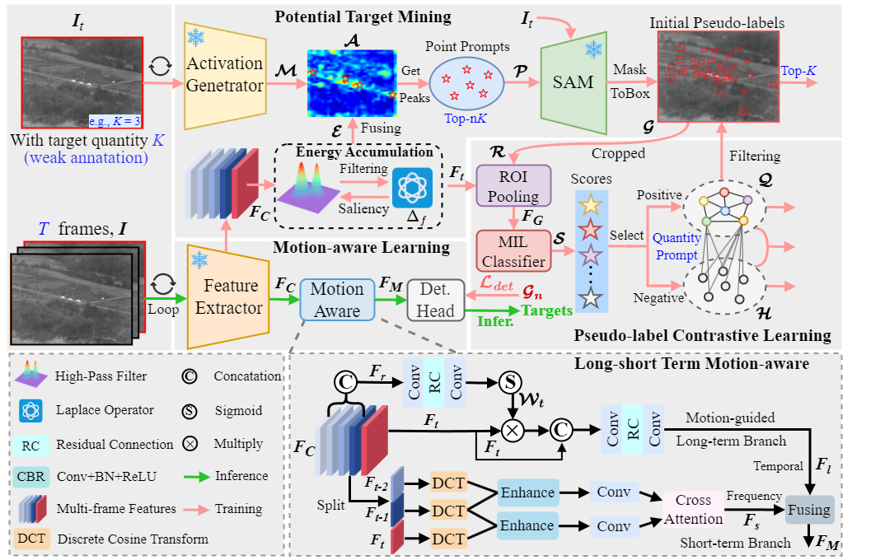
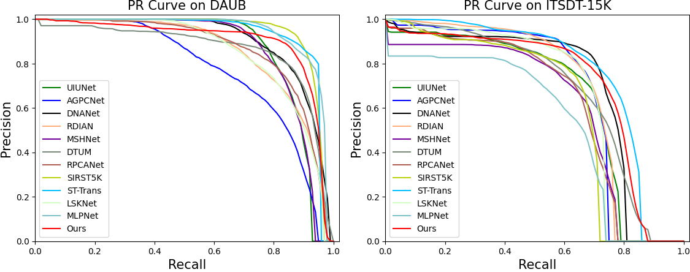

# WeCoL
**Weakly-supervised Contrastive Learning with Quantity Prompts for Moving Infrared Small Target Detection [Under Review]**

Currently, the code is undergoing further refinement. We will update it as soon as possible after the paper is accepted.


## Abstract
Different from general object detection, moving infrared small target detection faces huge challenges due to tiny target size and weak background contrast. Currently, most existing methods is fully-supervised, heavily relying on a large number of manual target-wise annotations. However, manually annotating video sequences is often expensive and time-consuming, especially for low-quality infrared frame images. Inspired by general object detection, non-fully supervised strategies (e.g., weakly supervised) are believed to be potential in reducing annotation requirement. To break through traditional fully-supervised frameworks, as the first exploration work, this paper proposes a new weakly-supervised contrastive learning (WeCoL) scheme, only needing simple target quantity prompts in model training. Specifically, in our scheme, based on the pretrained segment anything model (SAM), a potential target mining strategy is designed to integrate target activation maps and multi-frame energy accumulation. Besides, contrastive learning is adopted to further improve the reliability of pseudo-labels, by calculating the similarity between positive and negative samples in feature subspace. Moreover, we proposes a long-short term motion-aware learning scheme to simultaneously model the local motion patterns and global motion trajectory of small targets. The extensive experiments on two public datasets (DAUB and ITSDT-15K) verify that our weakly-supervised scheme could often outperform early fully-supervised methods. Even, its performance could reach over 90% of state-of-the-art (SOTA) fully-supervised ones. 

## Prerequisite
- python == 3.8
- pytorch == 1.10.0
- einops == 0.7.0
- opencv-python == 4.7.0.72
- scikit-learn == 1.2.2
- scipy == 1.9.1
- Tested on Ubuntu 22.04.6, with CUDA 12.0, and 1x NVIDIA 4090(24 GB)

## PR Curve


## Datasets
- You can download them directly from the website: [DAUB](https://www.scidb.cn/en/detail?dataSetId=720626420933459968), [ITSDT](https://www.scidb.cn/en/detail?dataSetId=de971a1898774dc5921b68793817916e&dataSetType=journal), [IRDST](https://xzbai.buaa.edu.cn/datasets.html).
- You can also directly download the organized version of our paper. [DAUB](https://pan.baidu.com/share/init?surl=nNTvjgDaEAQU7tqQjPZGrw&pwd=saew), [ITSDT-15K](https://drive.google.com/file/d/1nnlXK0QCoFqToOL-7WdRQCZfbGJvHLh2/view?usp=sharing). 
- The COCO format json file needs to be converted into a txt format file. 
```
python utils_coco/coco_to_txt.py
```
- The folder structure should look like this:
```
DAUB
├─instances_train2017.json
├─instances_test2017.json
├─coco_train_DAUB.txt
├─coco_val_DAUB.txt
├─images
│   ├─1
│   │   ├─0.bmp
│   │   ├─1.bmp
│   │   ├─2.bmp
│   │   ├─ ...
│   ├─2
│   │   ├─0.bmp
│   │   ├─1.bmp
│   │   ├─2.bmp
│   │   ├─ ...
│   ├─3
│   │   ├─ ...
```
## Usage
### Train
```
CUDA_VISIBLE_DEVICES=0 python train_{dataset}.py
```
### Test
- Usually model_best.pth is not necessarily the best model. The best model may have a lower val_loss or a higher AP50 during verification.
```
CUDA_VISIBLE_DEVICES=0 python vid_map_coco.py
```
### Visulization
```
python vid_predict.py
```
## Reference
1、Z. Ge, S. Liu, F. Wang, Z. Li, and J. Sun, “Yolox: Exceeding yolo series in 2021,” arXiv preprint arXiv:2107.08430, 2021.
2、Kirillov, A., Mintun, E., Ravi, N., Mao, H., Rolland, C., Gustafson, L., ... & Girshick, R. (2023). Segment anything. In Proceedings of the IEEE/CVF international conference on computer vision (pp. 4015-4026).
## Contact
IF any questions, please contact with Weiwei Duan via email: [dwwuestc@163.com]().