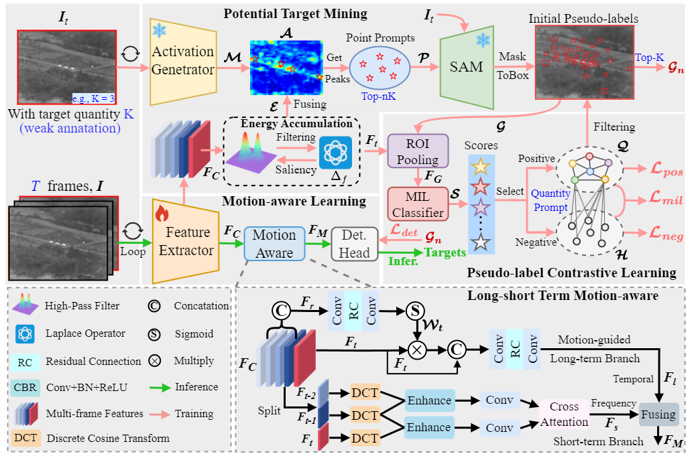
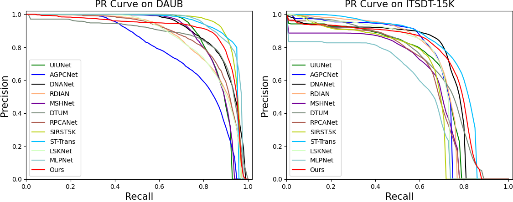

# WeCoL
**Weakly-supervised Contrastive Learning with Quantity Prompts for Moving Infrared Small Target Detection**

**Due to the reinstallation of the server's operating system, the main network files for this repository code are missing. We will update this repository as soon as possible.**


## Abstract
Different from general object detection, moving infrared small target detection faces huge challenges due to tiny target size and weak background contrast. Currently, most existing methods is fully-supervised, heavily relying on a large number of manual target-wise annotations. However, manually annotating video sequences is often expensive and time-consuming, especially for low-quality infrared frame images. Inspired by general object detection, non-fully supervised strategies (e.g., weakly supervised) are believed to be potential in reducing annotation requirement. To break through traditional fully-supervised frameworks, as the first exploration work, this paper proposes a new weakly-supervised contrastive learning (WeCoL) scheme, only needing simple target quantity prompts in model training. Specifically, in our scheme, based on the pretrained segment anything model (SAM), a potential target mining strategy is designed to integrate target activation maps and multi-frame energy accumulation. Besides, contrastive learning is adopted to further improve the reliability of pseudo-labels, by calculating the similarity between positive and negative samples in feature subspace. Moreover, we proposes a long-short term motion-aware learning scheme to simultaneously model the local motion patterns and global motion trajectory of small targets. The extensive experiments on two public datasets (DAUB and ITSDT-15K) verify that our weakly-supervised scheme could often outperform early fully-supervised methods. Even, its performance could reach over 90% of state-of-the-art (SOTA) fully-supervised ones. 

## Pretrained Models
- InfMAE (Activation Generator). You can download from this [InfMAE](https://pan.baidu.com/s/1xofov5UWARRPVHB6586E2w?pwd=Apth) and put it into model_data/
- SAM (Segmentation Foundation Model). You can download from this [sam_vit_h_4b8939](https://huggingface.co/HCMUE-Research/SAM-vit-h/blob/main/sam_vit_h_4b8939.pth) and put it into nets/segment_anything/pretrained/

## Prerequisite
- scipy==1.10.1
- numpy==1.24.4
- matplotlib==3.7.5
- opencv_python==4.9.0.80
- torch==2.0.0+cu118
- torchvision==0.12.0
- tqdm==4.65.2
- Pillow==9.5.0
- pycocotools==2.0.7
- timm==0.9.16
- pyhton==3.8.19
- Tested on Ubuntu 22.04.6, with CUDA 12.0, and 1x NVIDIA 4090(24 GB)

## PR Curve


## Datasets
- You can download them directly from the website: [DAUB](https://www.scidb.cn/en/detail?dataSetId=720626420933459968), [ITSDT](https://www.scidb.cn/en/detail?dataSetId=de971a1898774dc5921b68793817916e&dataSetType=journal).
- You can also directly download the organized version of our paper. [DAUB](https://pan.baidu.com/share/init?surl=nNTvjgDaEAQU7tqQjPZGrw&pwd=saew), [ITSDT-15K](https://drive.google.com/file/d/1nnlXK0QCoFqToOL-7WdRQCZfbGJvHLh2/view?usp=sharing). 
- The COCO format json file needs to be converted into a txt format file. 
```
python utils_coco/coco_to_txt.py
```
- The fully-supervised format txt needs to be converted into a weakly-supervised format (/home/public/ITSDT/images/1/35.bmp 418,463,441,475,0   --> /home/public/ITSDT/images/1/35.bmp 1)
```
python utils_coco/process_datasets.py
```

- The folder structure should look like this:
```
DAUB
├─instances_train2017.json
├─instances_test2017.json
├─Num_train_DAUB.txt
├─Num_val_DAUB.txt
├─images
│   ├─1
│   │   ├─0.bmp
│   │   ├─1.bmp
│   │   ├─2.bmp
│   │   ├─ ...
│   ├─2
│   │   ├─0.bmp
│   │   ├─1.bmp
│   │   ├─2.bmp
│   │   ├─ ...
│   ├─3
│   │   ├─ ...
```
## Usage
### Train
```
CUDA_VISIBLE_DEVICES=0 python train_{dataset}.py
```
### Test
- Usually model_best.pth is not necessarily the best model. The best model may have a lower val_loss or a higher AP50 during verification.
- We also provide the weights of our wecol on DAUB and ITSDT-15K, [code: 76c5](https://pan.baidu.com/s/1jRDBAL6gEWyKTghPeZSHFg)
```
CUDA_VISIBLE_DEVICES=0 python test_{dataset}.py
```
### Visulization
```
python predict.py
```

### Mapping Relations
- Activation Generation -- nets/activation_generator.py, wecol.py (line341-345)
- Enery Accumulation -- nets/energy_accumulation.py, wecol.py (line 337-339)
- Peak Point Selection -- nets/peak_point_generator.py, wecol.py (line 347-350)
- SAM for initial pseudo-labels -- nets/sam_processor.py, wecol.py (line 351-253)
- Long-short term motion-aware -- wecol.py (line 247-265)
- Pseudo-label Contrastive Learning -- wecol.py (line 268-297)


## Reference
1、Z. Ge, S. Liu, F. Wang, Z. Li, and J. Sun, “Yolox: Exceeding yolo series in 2021,” arXiv preprint arXiv:2107.08430, 2021.
2、Kirillov, A., Mintun, E., Ravi, N., Mao, H., Rolland, C., Gustafson, L., ... & Girshick, R. (2023). Segment anything. In Proceedings of the IEEE/CVF international conference on computer vision (pp. 4015-4026).
## Contact
IF any questions, please contact with Weiwei Duan via email: [dwwuestc@163.com]().
